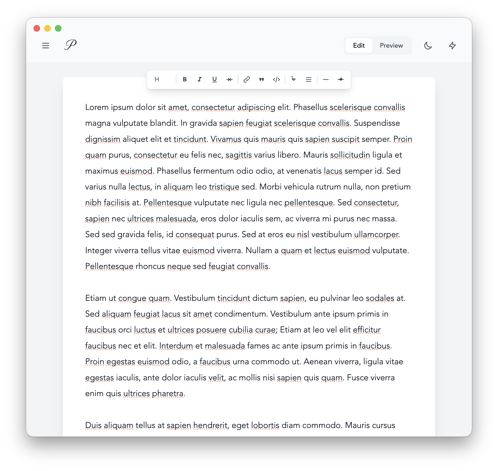

<div>
   
    <p>
A minimalist Markdown editor designed for focused writing with AI-powered assistance and real-time preview capabilities.

I live in Markdown. Every blog post, every note, every README, every chapter of my novel—it all starts as plain text with simple formatting marks. After years of this workflow, I've developed strong opinions about how a Markdown editor should work. Apparently, *very* strong opinions.

Halfway through writing my novel, I realized I was switching between editors throughout the day, each one frustrating me in different ways. One had beautiful typography but buried essential features in menus. Another handled Markdown perfectly but looked like it was designed in 2005. Some were bloated with features I'd never use, turning my simple writing environment into an interface that looked like it belonged in a NASA control center.

The more I wrote, the more these small frustrations compounded. I found myself spending more time fighting with my tools than actually writing. When you're trying to maintain flow state while crafting a narrative, even the smallest friction feels like sandpaper on your brain.

So I did what any self-respecting software engineer would do: I spent a weekend building exactly what I wanted.
   </p>
</div>

<div style="text-align: center;">
   
</div>

**Prose** is a lightweight React app built for writers who love Markdown. It's not trying to be everything to everyone. It's trying to be one thing exceptionally well: a clean, fast, distraction-free environment for writing in Markdown.

Prose embodies my personal philosophy about writing tools:

**Markdown formatting should be invisible when editing.** Formatting marks should be treated as plain text while editing. Visual simplicity is one of my favorite aspects of writing in plain text.

**Text presentation matters.** Good typography isn't a luxury—it's essential for long writing sessions. Your eyes should feel comfortable after hours of work, and your writing should be presented in a visually appealing style. When reading, text should always be *fully justified.*

**Lightweight doesn't mean featureless.** It means every feature earns its place. No bloat, no feature creep, just the tools you actually use while writing.

**The UI should disappear.** When you're in flow, you shouldn't notice the interface at all. It should be so intuitive that it becomes invisible.

## Who It's For

Prose is for writers who:
- Default to Markdown for everything
- Value simplicity over feature lists
- Want their tools to respect their focus
- Believe that good writing tools should inspire you to write, not distract you from it

It's the editor I wished existed when I was deep in Chapter 12, trying to maintain momentum while my current editor decided to auto-format my dialogue in ways that made me want to throw my laptop out the window.

## Features

### Core Functionality
- **Clean Markdown Editor** - Distraction-free writing environment with auto-resizing text area
- **Real-time Preview** - Toggle between edit and preview modes with live Markdown rendering
- **Document Management** - Create, save, rename, and delete documents with SQLite storage
- **Auto-save** - Automatic document saving after 3 seconds of inactivity
- **Dark/Light Mode** - System-responsive theme with manual toggle
- **Rich Text Toolbar** - Quick formatting buttons for common Markdown elements

### AI Integration
- **Writing Suggestions** - Generate AI-powered improvements for your content
- **Interactive Q&A** - Ask questions about your document and get contextual answers
- **OpenAI Integration** - Uses GPT-3.5-turbo for intelligent writing assistance

### Technical Features
- **Responsive Design** - Optimized for desktop writing workflows
- **Syntax Highlighting** - Code blocks with highlight.js support
- **GitHub Flavored Markdown** - Full GFM support including tables, strikethrough, and more
- **Document Persistence** - SQLite database with automatic backups to localStorage

## Technology Stack

- **Frontend**: React 19 with React Router v7
- **Styling**: Tailwind CSS with custom design system
- **Build Tool**: Vite with hot module replacement
- **Backend**: Express.js server with REST API
- **Database**: Better SQLite3 for document storage
- **Markdown**: react-markdown with remark-gfm and rehype-highlight
- **AI**: OpenAI GPT-3.5-turbo integration

## Getting Started

### Prerequisites
- Node.js 18+ 
- npm or yarn

### Installation

1. **Clone the repository**
   ```bash
   git clone https://github.com/nathan-a-king/Prose.git
   cd Prose
   ```

2. **Install dependencies**
   ```bash
   npm install
   ```

3. **Set up environment variables (optional)**
   ```bash
   # Create .env file for OpenAI integration
   VITE_OPENAI_API_KEY=your_openai_api_key_here
   ```
   *Note: If not provided, the app will prompt for the API key when using AI features*

4. **Start development server**
   ```bash
   npm run dev
   ```
   Opens at `http://localhost:3000`

5. **Build for production**
   ```bash
   npm run build
   npm start
   ```
   Production server runs on `http://localhost:8080`

## Development Commands

| Command | Description |
|---------|-------------|
| `npm run dev` | Start Vite development server with hot reload |
| `npm run build` | Create optimized production build |
| `npm run preview` | Preview production build locally |
| `npm start` | Run Express production server |

## Architecture

### Frontend Structure
```
src/
├── components/
│   ├── layout/Layout.jsx          # Main layout wrapper
│   └── ui/ThemeToggle.jsx         # Dark/light mode toggle
├── contexts/
│   └── ThemeContext.jsx           # Theme state management
├── pages/
│   └── HomePage.jsx               # Main editor interface
├── services/
│   └── documentApi.js             # API client for documents
├── styles/
│   ├── index.css                  # Global styles
│   └── editor.css                 # Editor-specific styles
├── App.jsx                        # Root component with routing
└── main.jsx                       # Application entry point
```

### Backend Structure
```
├── server.js                      # Express server with API routes
├── database.js                    # SQLite database setup and operations
└── build/                         # Production build output
```

### Key Features Implementation

- **Document Management**: SQLite database with prepared statements for performance
- **Real-time Autosave**: React useEffect with debounced saving
- **AI Integration**: Direct OpenAI API calls with error handling
- **Markdown Rendering**: ReactMarkdown with custom components for styling
- **Theme System**: React Context with localStorage persistence
- **Responsive Layout**: CSS-in-JS with Tailwind for consistent styling

## API Endpoints

| Method | Endpoint | Description |
|--------|----------|-------------|
| `GET` | `/api/documents` | Get all documents |
| `GET` | `/api/documents/:id` | Get specific document |
| `POST` | `/api/documents` | Create new document |
| `PUT` | `/api/documents/:id` | Update document |
| `DELETE` | `/api/documents/:id` | Delete document |
| `PUT` | `/api/documents/:id/order` | Update document display order |

### Document Ordering

The document ordering endpoint allows you to reorder documents in the sidebar:

**Endpoint:** `PUT /api/documents/:id/order`

**Request Body:**
```json
{
  "order": 2
}
```

**Response:**
```json
{
  "success": true,
  "document": {
    "id": 1,
    "name": "My Document",
    "content": "...",
    "display_order": 2,
    "created_at": "2025-01-09T10:00:00Z",
    "updated_at": "2025-01-09T10:30:00Z"
  }
}
```

Documents are automatically reordered when one is moved, maintaining sequential order numbers. Documents with lower `display_order` values appear first in the list.

## Configuration

### Vite Configuration
- Development server on port 3000
- API proxy to backend on port 8080
- Optimized builds with vendor/router code splitting

### Tailwind Customization
- Custom color palette (primary blue shades)
- Avenir/Avenir Next font stack
- Custom animations (fade-in, slide-up)
- Dark mode via class strategy

## AI Features Setup

The AI features require an OpenAI API key. You can provide it in three ways:

1. **Environment Variable** (recommended)
   ```bash
   VITE_OPENAI_API_KEY=your_key_here
   ```

2. **Runtime Prompt** - The app will ask for your key when first using AI features

3. **localStorage** - Your key is saved locally after first use for convenience

## Contributing

1. Fork the repository
2. Create a feature branch (`git checkout -b feature/amazing-feature`)
3. Commit your changes (`git commit -m 'Add amazing feature'`)
4. Push to the branch (`git push origin feature/amazing-feature`)
5. Open a Pull Request

## License

This project is licensed under the MIT License - see the [LICENSE](LICENSE) file for details.

## Acknowledgments

- Built with React 19 and modern web technologies
- Markdown rendering powered by react-markdown
- Code highlighting by highlight.js
- AI features powered by OpenAI GPT-3.5-turbo
- Styled with Tailwind CSS custom design system